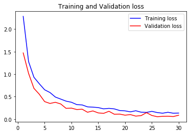
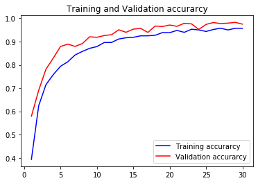

## Abstract

Deep neural networks has been highly successful in image classification problems. In this paper, we show how neural networks can be used for plant disease
recognition in the context of image classification. We have used publicly available
Plant Village dataset which has 38 classes of diseases. Hence, the problem that we
have addressed is a multi class classification problem. We compared five different
architectures including VGG16, ResNet50, InceptionV3, InceptionResNet and
DenseNet169 as the backbones for our work. We found that ResNet50 achieves
the best result on the test set. For evaluation, we used metrics: accuracy, precision,
recall, F1 score and class wise confusion metric. Our model achieves the best of
results using ResNet50 with accuracy of 0.982, precision of 0.94, recall of 0.94
and F1 score of 0.94.

## Data

The dataset can be downloaded from [here](https://github.com/spMohanty/PlantVillage-Dataset).

## Environment and tools

1. Jupyter Notebook
2. Numpy
3. Pandas
4. Scikit-image
5. Matplotlib
6. Scikit-learn
7. Keras

## Installation

`pip install numpy pandas scikit-image matplotlib scikit-learn keras`

`jupyter notebook`

## Results

### Visualization of Feature Maps

### Loss vs Epoch

### Accuracy vs Epoch

### Confusion Matrix

### Comparison of pre trained weights on results

